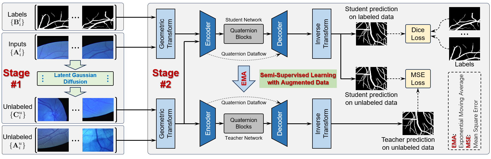

# Multi-View Orientational Quaternion Network with Latent Diffusion Model for Semi-Supervised Vessel Segmentation


We propose LD-MOQ, a multi-view orientational quaternion network with latent diffusion model for semi-supervised vessel segmentation. LD-MOQ involves two stages. In the first stage, a latent diffusion model is used to expand the pool of unlabeled data, which reduces the workload of data annotation and addresses the privacy issue related to vessel data collection. In the second stage, we innovatively propose a multi-view orientational quaternion network to capture global feature embeddings in the horizontal and vertical views of multi-dimensional quaternion space, and enhance perception of vessels in the geometric orientation. Moreover, we introduce an end-to-end reversible geometric transformation to enhance the training data, effectively utilizing the capabilities of consistency-based SSL, resulting in improved segmentation accuracy. The experiments of across domain vessel datasets demonstrate the effectiveness of LD-MOQ in bridging probability distribution knowledge to the segmentation network and enhancing the semantic representation of vessel images.



This demo code reproduces the results for semi-supervised segmentation on STARE, CHASE DB, EM, DRIVE, DCA1, and XCAD datasets.

Please follow the following pipeline to reproduce the results.

## Requirements

The code is tested under Ubuntu 18.04, CUDA 10.2, PyTorch 1.13.0
Install the required packages through

```
pip install -r requirements.txt
```

## Datasets

Prepare datasets for evaluation.

```
mkdir ./Dataset
cd ./Dataset


## Run training script

Train fully supervised baseline model and SemiDiff model by running the following script.

```
sh train.sh
```

To change the default dataset, please update inside train.sh script.

```commandline
Dataset=DRIVE # dataset to use [option:STARE, CHASE DB, EM and DRIVE]
```
## Training

python main.py --GPU 0 --net ResUnet_Q --Mode train --Epoch 1000 --LearningRate 1e-3 --batchsize 8 --SaveRslt 1 --labelpercent 0.01 --seed_split 0 --loss Dice+ConsistMSE_loss --ssl MeanTeacher --Alpha 0.999 --Gamma 5 -ta DRIVE -vf 2 --MaxTrIter 5 --RampupEpoch 500 --RampupType Exp


## Testing
python main.py --GPU 0 --net ResUnet_Q --Mode test --Epoch 1000 --LearningRate 1e-3 --batchsize 8 --SaveRslt 1 --labelpercent 0.01 --seed_split 0 --loss Dice+ConsistMSE_loss --ssl MeanTeacher --Alpha 0.999 --Gamma 5 -ta DRIVE -vf 2 --MaxTrIter 5 --RampupEpoch 500 --RampupType Exp
